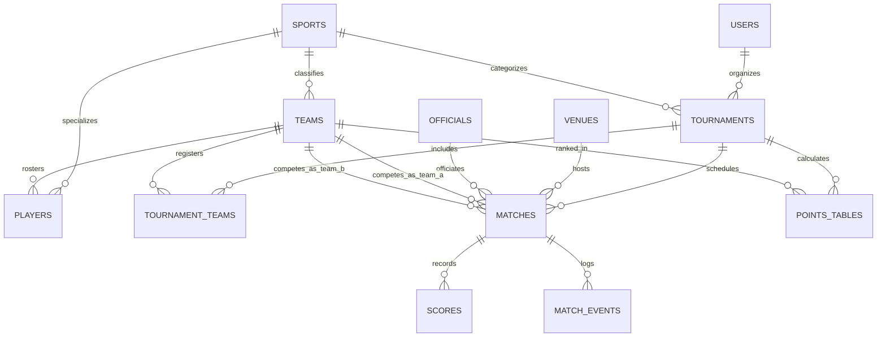

# BRAINME.md - SportsHub System Architecture & Developer Reference 🧠

This document provides a deep-dive architectural blueprint, relational schema specification, sport scoring engine mechanics, and extension guidelines for **SportsHub**.

---

## 📐 1. System Architecture Overview

SportsHub is built on a decoupled, modular 3-tier web architecture:

```
+-----------------------------------------------------------------------+
|                           CLIENT TIER                                 |
|   HTML5 + CSS3 (Design System) + Vanilla JS (DOM, Tickers, Filters)   |
+-----------------------------------------------------------------------+
                                  |
                                  v
+-----------------------------------------------------------------------+
|                           SERVER TIER                                 |
|   PHP 8.x + Config Routing + Session Auth + Database Fallback Provider|
+-----------------------------------------------------------------------+
                                  |
                                  v
+-----------------------------------------------------------------------+
|                          DATABASE TIER                                |
|   MySQL / MariaDB 10.x Relational Engine (Schema + Foreign Keys)      |
+-----------------------------------------------------------------------+
```

### Key Architectural Patterns
1. **Fallback Provider Pattern** (`includes/database.php`):
   - When MySQL connection is established, queries run dynamically against the database.
   - If MySQL service is inactive or pending setup, the application automatically switches to **Demo Mode**, rendering structured sample data so pages function seamlessly out-of-the-box.
2. **Modular Component Inclusions**:
   - `header.php`, `sidebar.php`, and `footer.php` encapsulate global UI framing and page state tracking.
3. **Sport Agnostic Core**:
   - Sports logic is parameterised via the `sports` table (`scoring_type`, `has_overs`, `has_halves`, `has_sets`).

---

## 🛢️ 2. Relational Database Schema Mapping (ER Overview)



### Key Foreign Key Constraints & Relationships
- `tournaments.organizer_id` $\rightarrow$ `users.id` (`ON DELETE CASCADE`)
- `tournaments.sport_id` $\rightarrow$ `sports.id` (`ON DELETE RESTRICT`)
- `matches.tournament_id` $\rightarrow$ `tournaments.id` (`ON DELETE CASCADE`)
- `scores.match_id` $\rightarrow$ `matches.id` (`ON DELETE CASCADE`)
- `scores.team_id` $\rightarrow$ `teams.id` (`ON DELETE CASCADE`)
- `points_tables.tournament_id` $\rightarrow$ `tournaments.id` (`ON DELETE CASCADE`)

---

## ⚡ 3. Multi-Sport Scoring Engine Logic Matrix

| Sport | Primary Score | Secondary Score | Over / Period Field | Key Events Logged |
| :--- | :--- | :--- | :--- | :--- |
| **Cricket** | Runs (e.g. `174`) | Wickets (e.g. `4`) | Overs (e.g. `18.4`) | `SIX`, `FOUR`, `WICKET`, `DOT_BALL`, `WIDE` |
| **Football** | Goals (e.g. `2`) | Shots on Target | Half / Min (e.g. `78'`) | `GOAL`, `YELLOW_CARD`, `RED_CARD`, `SAVED_PENALTY` |
| **Kabaddi** | Points (e.g. `34`) | Tackle Points | Half / Min (e.g. `28'`) | `SUPER_RAID`, `SUPER_TACKLE`, `ALL_OUT` |
| **Basketball**| Points (e.g. `88`) | Fouls | Quarter (e.g. `Q3 04:12`)| `BASKET_3PT`, `BASKET_2PT`, `FREE_THROW` |
| **Volleyball**| Sets Won (e.g. `3`) | Current Set Pts | Set Number (e.g. `Set 4`)| `ACE_SERVE`, `SPIKE_KILL`, `BLOCK_POINT` |
| **Badminton** | Sets Won (e.g. `2`) | Game Pts | Set Number (e.g. `Set 3`)| `SMASH_WINNER`, `NET_DROP` |
| **Tennis** | Sets Won (e.g. `2`) | Games / Pts | Set / Game (e.g. `Set 2`)| `ACE`, `DOUBLE_FAULT`, `BREAK_POINT` |
| **Table Tennis**| Sets Won (e.g. `3`)| Game Pts | Set Number (e.g. `Set 5`)| `EDGE_POINT`, `SERVICE_WINNER` |

---

## 📊 4. Standings & Net Run Rate (NRR) Formula

### Football & General Sports Standings
- $\text{Total Points} = (\text{Wins} \times 3) + (\text{Draws} \times 1)$
- $\text{Goal/Score Difference (GD)} = \text{Goals For} - \text{Goals Against}$

### Cricket Net Run Rate (NRR) Formula
$$\text{NRR} = \left( \frac{\text{Total Runs Scored}}{\text{Total Overs Faced}} \right) - \left( \frac{\text{Total Runs Conceded}}{\text{Total Overs Bowled}} \right)$$

---

## 🔮 5. Future Expansion Roadmap

### Phase 2: Live Scoring Console Enhancements
- Interactive ball-by-ball / minute-by-minute score entry panel for match officials.
- Automatic recalculation of `points_tables` upon match completion trigger.

### Phase 3: Knockout Bracket Visualizer
- Dynamic SVG / Canvas bracket view for Knockout and Group Stage + Knockout tournaments.

### Phase 4: WebSockets / Server-Sent Events (SSE)
- Real-time score streaming directly to public fan dashboards without page refresh.
